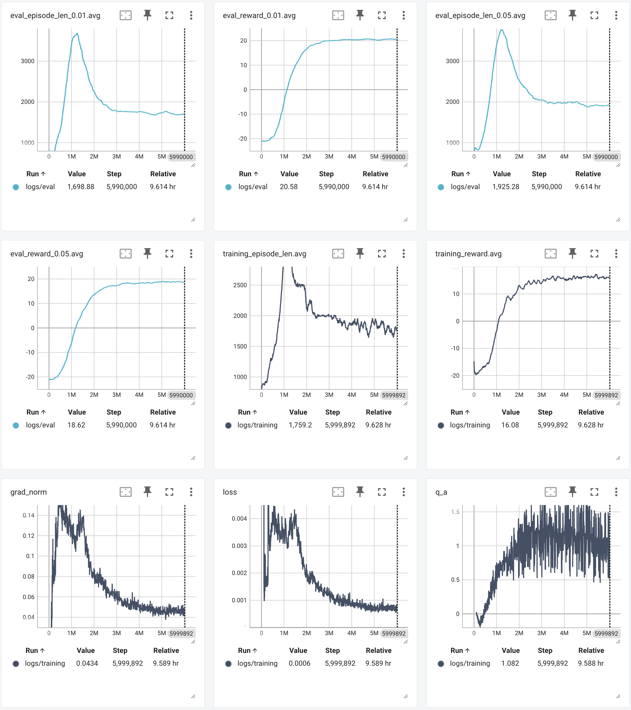
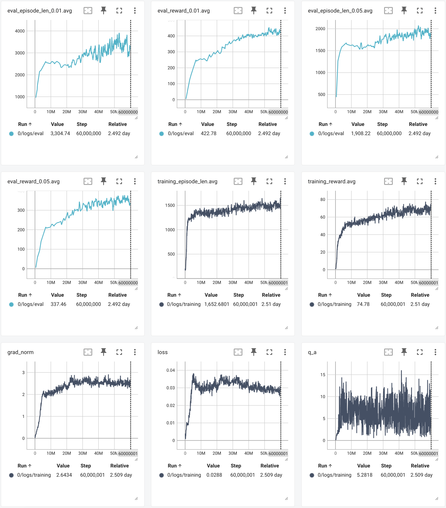

# A PyTorch Implementation of Vanilla Deep Q-Network (DQN)

This is a PyTorch implementation of the classic Deep Q-Network paper by Mnih et al: [Human-level control through deep reinforcement
learning](https://storage.googleapis.com/deepmind-data/assets/papers/DeepMindNature14236Paper.pdf). It's based on the vanilla DQN without additional techniques such as double DQN or dueling DQN, and was able to match the paper's results on Pong and Breakout (other games were not tested).

- Pong: maximum testing reward of 19 in 6 million steps (v.s. benchmark 18.9 +/- 1.3)
- Breakout: maximum testing reward of 377.6 in 60 million steps (v.s. benchmark 401.2 +/- 26.9)

Here, testing reward (labeled as eval_reward_0.05.avg in the reference charts below) is calculated by taking the mean of a rolling window of the most recent 50 eval episodes, where an eval eposide is run once every 10k steps, with a 5% exploration rate.

*Pong: metrics for 6 million training steps*


*Breakout: metrics for 6 million training steps*


## Usage
Installing dependencies
```
$ pip install -r requirements.txt
$ sudo apt-get install libgl1-mesa-glx
```

Train a model for a specific game
```
$ python train.py <game> <number of training steps>
```

Use a trained model to play a game
```
$ python play.py <game> <path_to_model>
```